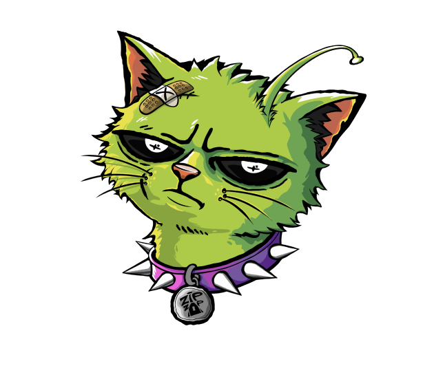

<p align="center">  <br> </p>

# GLORP: The Pixel-to-Vector Beast

**Bzibi&ti tpi\$onch... BLAP BLAP BLAAA...**

GLORP is a lightweight desktop application written in **Python + PySide6
(Qt)** that\
**converts raster pixel art into clean, optimized SVG vector files**.

Designed for pixel artists, indie developers, UI designers, and anyone
who requires\
**crisp edges**, **accurate color preservation**, and **efficient vector
output**.

This version runs on a modern Qt-based rendering engine with improved UI
responsiveness,\
smooth animations, and stable threaded batch processing.

## 🚀 Download & Examples

If you just want to use the tool without running the script, you can
download the compiled version here:

**[👉 Download GLORP on
Itch.io](https://zackdurec.itch.io/glorp-pixel-to-svg)**

On the Itch.io page, you'll also find: \* **Visual Examples**:
Comparison between original PNG and optimized SVG. \* **Mode Previews**:
See the difference between "Monolith" and "Lego" modes. \* **UI
Screenshots**: Overview of the current Qt-based interface.

### 🖼️ Why use GLORP?

-   **For Printing**: Perfect for stickers, t-shirts, and posters where
    infinite scaling is required.
-   **For Web**: Optimized SVGs remain lightweight and sharp on any
    display.
-   **Batch Processing**: Convert dozens or hundreds of sprites
    efficiently.
-   **Editor Friendly Output**: Clean structure, especially in Monolith
    mode.

Mi mi mi... *GLORP hungers for squares.*

------------------------------------------------------------------------

## 🧪 The Sacred Rules (Preparation)

To avoid bloated or inefficient SVG output:

-   **Original Size Only**\
    Use native pixel resolution such as `16×16`, `32×32`, `64×64`, etc.

-   **Nearest Neighbor Only**\
    If resizing is required, use **Nearest Neighbor** scaling only.\
    Bilinear or Bicubic interpolation introduces artifacts.

-   **PNG with Transparency**\
    RGBA transparency is fully supported and preserved.

-   **Hard Edges Only**\
    Not suitable for photos, gradients, or blurred imagery.

GLORP is optimized strictly for pixel-perfect artwork.

------------------------------------------------------------------------

## 🛠 How to Use

1.  **Select Images**\
    Add files via button or drag & drop.

2.  **Preview (Hover)**\
    Hover over filenames to see pixel-accurate previews.

3.  **Choose Output Folder**

4.  **Pick Your Mutation Mode :**

# 🗿 Monolith (Recommended)

Uses a greedy meshing algorithm: - Merges adjacent pixels of identical
color - Produces compact `<path>` elements - Significantly reduces SVG
size - Ideal for editing in vector software


# 🧱 Lego

Each pixel becomes an individual 1×1 `<rect>`. - Exact pixel
representation - Large object count - May reduce performance in vector
editors


5.  **Convert** Execute conversion. Processing runs in a separate thread
    to prevent UI freezing.

------------------------------------------------------------------------

## ⚠️ Technical Warnings

-   **Lego Mode Risk**\
    260 × 260 = **67,600 objects**\
    Large files may impact performance.

-   **Maximum Pixel Limit**\
    Safety cap at 1,000,000 pixels per image.

-   **No Photo Support**\
    Complex gradients generate inefficient SVG output.

------------------------------------------------------------------------

## 🧬 What's Inside (Current Version)

-   Python + PySide6 (Qt6)
-   Pillow (PIL) for RGBA processing
-   NumPy – Fast matrix operations for contour detection
-   Greedy meshing vector optimization
-   Drag & Drop support
-   Hover preview tooltips
-   Animated UI transitions
-   Threaded batch conversion
-   Automatic file renaming
-   Lego performance detection overlay

------------------------------------------------------------------------

## 🩸 Run the Ritual

``` bash
pip install -r requirements.txt
python glorp.py
```

Requires: - Python 3.10+ - PySide6 - Pillow

------------------------------------------------------------------------

## 🍕 Appetite (Batch Processing)

There is **no hard limit** on selected files.

-   Files are processed sequentially.
-   UI remains responsive during conversion.
-   System RAM is the practical limitation.

Give it a single sprite or an entire folder.

------------------------------------------------------------------------

Special thanks to **[Harry Tsang](https://www.linkedin.com/in/cheuk-nam-tsang-2997671b3/)** for Algorithm Optimization  ❤️

------------------------------------------------------------------------

GLORP CONSUMES.


