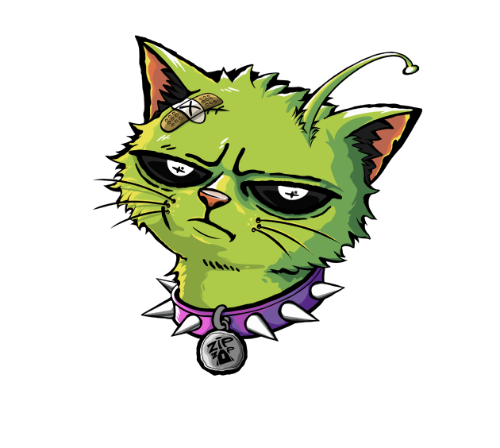

<p align="center">  <br> </p>

# GLORP: The Pixel-to-Vector Beast

**Bzibi&ti tpi$onch... BLAP BLAP BLAAA...**

GLORP is a high-performance utility designed to transform **raster pixel art into optimized SVG vector files**.

Designed for pixel artists, indie developers, and UI designers who require **crisp edges**, **accurate color preservation**, and **efficient vector output**.

---

## 🚀 Access & Download

### 🌐 **[RUN GLORP IN BROWSER (NEW)](https://zackgphom.github.io/GLORP/)**
No installation required. Pure WebAssembly mutation.

### 💻 **[Download GLORP on Itch.io](https://zackdurec.itch.io/glorp-pixel-to-svg)**
Desktop version (Windows) for local batch processing.

On the Itch.io page, you'll also find **Visual Examples**:
- Comparison between original PNG and optimized SVG.
- **Mode Previews** - See the difference between "Monolith" and "Lego" modes.

---

### 🖼️ Why use GLORP?

- **For Printing**: Perfect for stickers, t-shirts, and posters where infinite scaling is required.
- **For Web**: Optimized SVGs remain lightweight and sharp on any display.
- **Batch Processing**: Convert dozens or hundreds of sprites efficiently.
- **Editor Friendly Output**: Clean structure, especially in Monolith mode.

Mi mi mi... *GLORP hungers for squares.*

------------------------------------------------------------------------

## 🧪 The Sacred Rules (Preparation)

To avoid bloated or inefficient SVG output:

- **Original Size Only**: Use native pixel resolution (e.g., `16×16`, `32×32`).
- **Nearest Neighbor Only**: Avoid bilinear scaling to prevent artifacts.
- **PNG with Transparency**: RGBA transparency is fully supported.
- **Hard Edges Only**: Not suitable for photos or gradients.

------------------------------------------------------------------------

## 🛠 Mutation Modes

### 🗿 Monolith (Recommended)
Uses a greedy meshing algorithm: 
- Merges adjacent pixels of identical color.
- Produces compact `<path>` elements.
- Ideal for editing in vector software.


### 🧱 Lego
Each pixel becomes an individual 1×1 `<rect>`. 
- Exact pixel representation.
- Large object count (performance heavy).


### 🌐 WebP
Exports the image as a high-quality **lossless WebP** file.
- Significantly smaller than PNG.
- Ideal for web optimization.

------------------------------------------------------------------------

## ⚖ Mode Comparison

| Mode      | Output Type | Optimization | Editing Friendly | File Size |
|-----------|------------|--------------|------------------|-----------|
| Monolith  | SVG        | High         | Excellent        | Small     |
| Lego      | SVG        | None         | Limited (heavy)  | Large     |
| WebP      | Raster     | N/A          | No (not vector)  | Very Small |

------------------------------------------------------------------------

## 🧬 Inside the Engine

- **WASM / Pyodide Core**: High-speed Python logic running in-browser.
- **NumPy Matrix Ops**: Fast contour detection.
- **Greedy Meshing**: Advanced vertex consolidation.
- **Threaded Batching**: Process entire folders without UI freezing.

------------------------------------------------------------------------

## 🛠 Local Setup (Desktop)

```bash
pip install -r requirements.txt
python glorp.py
